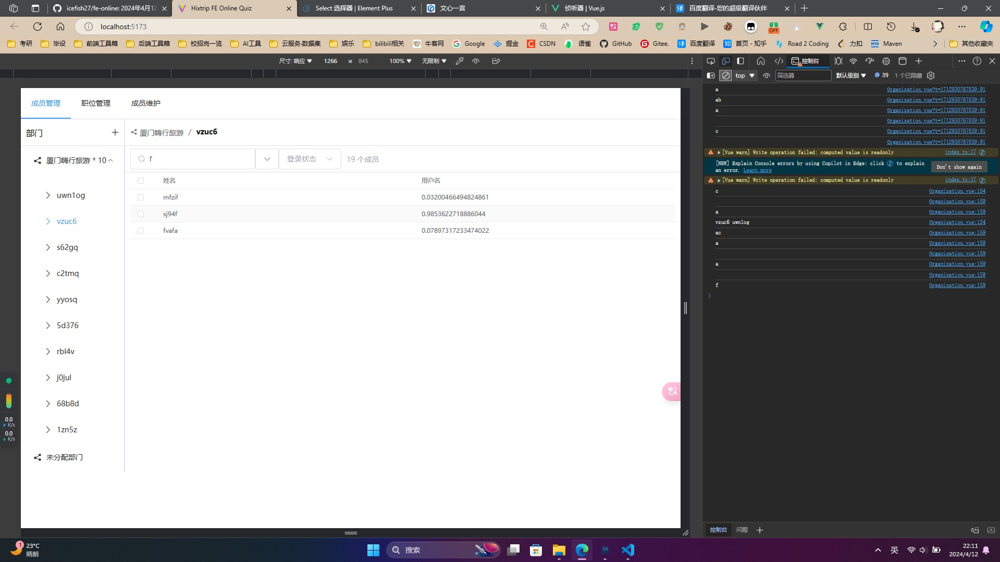
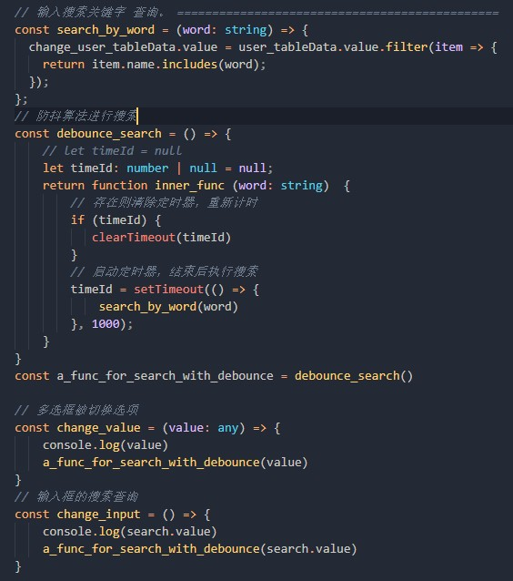

# Hixtrip FE Online

## 准备

- fork 此仓库
- 根据如下要求实现相关代码
- 完成要求
  - 提交`pull request`
  - 提供页面截图

## 需求

1. 目前已经有`src/api/user.ts` 以及 `src/api/org.ts` 两个 API
2. 需要实现如下效果界面：


> 功能要求：
- 不限 ```React``` 或者 ```Vue```
- 需要拆分 `OrgTree` 以及 `UserTable` 两个组件
  - 两个组件自己维护相关的数据。
  - 体现两个组件的互相通信。
- 组织架构根据点上级节点进行查询子级节点实现异步加载。
- 用户 ```Table ``` 数据跟据点击 ```组织架构树形节点``` 以及 ```输入搜索关键字``` 查询。
  - 需要考虑防抖节流等功能点
- 风格不限
  - 示例图仅仅是效果展示，不需要完全符合。
  - 可以使用 ```UI Framework```, 如 ```ant-design```, ```element-ui```等
  - 如果不用```UI Framework```, 可以直接用原生的```<ul> <li>```, ```<table>``` 实现，不用实现相关的CSS样式, 可以加分。

## 实现效果
> 项目实现效果图


> 防抖算法-加持-搜索功能


## 其他简答题

### 如何将如下的`JSON`正确解析成 `Object`
```json
{
  "userId": 111323290434354540545
}
```


> ========================================================================


> 答: 可以字面量也可以new Object 或者构造函数 实例化一个对象obj,然后obj.userId = 该json的userId

> ( 不是很理解该问题的意义, 您的意思是 有一个json字符串如何转json使用? JSON.parse() )


> ========================================================================

### 前端需要*稳定*每隔`1s`向服务端请求`API`, 请问如何实现？

> ========================================================================

> 可以for 循环 每次启动一个定时器. 考虑到 for循环内容是是同步执行完的, 定时器是异步的, 可以每次给定时器时间+1秒

例如：
```javascript
for (let i = 0; i < song_data.length; i++) {
        setTimeout(()=>{
           // 请求api
           xxxAPI().then(res=>{}).catch(e=>{})
        }, 1000* (i + 1))
    }

```

> ========================================================================

### 什么情况下，你会为你的项目引入状态管理库，比如`Redux`, `Pinia`, 可以简述一下起到了什么作用么？
- 保存登录后的用户信息，甚至是需要持久化存储
- 多个页面共用一个audio对象，共用音乐播放状态，共用音乐播放逻辑。来达到在spa单页面应用中切换页面可以一贯的听同一首歌，甚至可以在多个不同组件中控制同一个歌曲的播放逻辑


### 为什么`ESM`与`CJS`不能兼容？
> 以下百度的：

ESM（ECMAScript Modules）和CJS（CommonJS）在JavaScript中分别代表了两种不同的模块系统规范，它们之间存在不兼容性的主要原因在于它们的设计哲学和运行时的差异。

加载方式的差异：CJS采用同步加载的方式，每个模块单独执行，避免了命名冲突和全局变量污染。而ESM则是异步加载的，它在编译时就定义了模块，这有助于在代码拆分和懒加载时实现更高效的资源利用。
运行时的差异：CJS在运行时加载模块，这意味着它可以在代码执行期间动态地改变模块的内容。相比之下，ESM是静态的，它在编译时确定模块的依赖关系，这有助于在工具链中进行静态分析，例如代码压缩、摇树优化等。
API和语法的差异：ESM和CJS在API和语法上也有明显的不同。例如，ESM使用import和export关键字来导入和导出模块，而CJS则使用require和module.exports。
由于这些根本性的差异，ESM和CJS并不能直接兼容。当尝试在一个支持ESM的环境中运行CJS代码，或者反之，通常会导致错误或不可预期的行为。

然而，随着JavaScript生态系统的发展，许多构建工具和打包器（如Webpack、Rollup等）已经提供了转换和兼容性处理机制，使得开发者可以在同一个项目中混合使用ESM和CJS，或者在构建过程中将一种规范转换为另一种规范。这些工具通常通过一定的配置和插件来实现这种转换，以确保代码的顺利运行。

总的来说，虽然ESM和CJS不能直接兼容，但通过工具和构建过程的支持，开发者仍然可以在项目中灵活地使用它们。